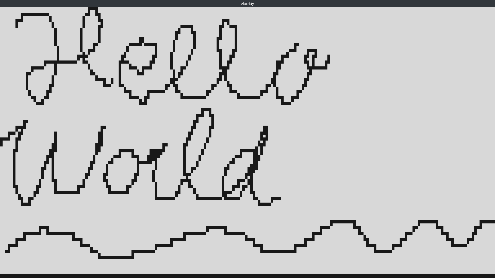

# blockpaint2

A proof of concept for a new, more lightweight, and much simpler implementation of the original BlockPaint: https://github.com/wooster0/blockpaint

BlockPaint is a painting application that runs in a terminal emulator and uses the mouse.

This time it has no external library dependency bloat and the binary comes down to 4216 bytes (0.004 MB) in ReleaseSmall. Even if you implement all other features of the original BlockPaint the result shouln't cross a megabyte.
The original BlockPaint binary has a size of over 4 MB.

